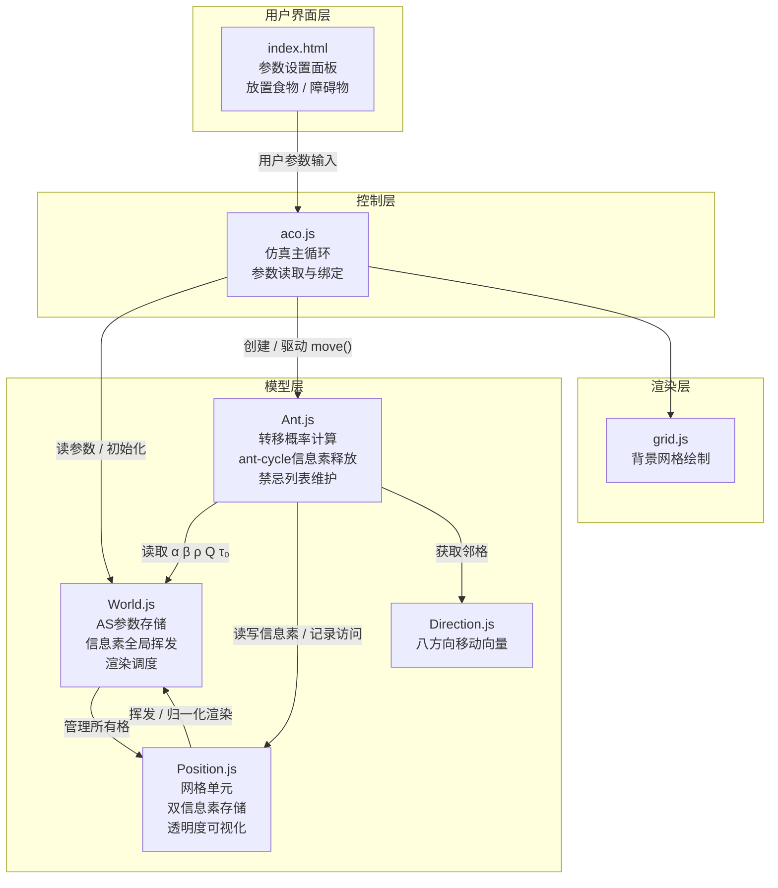
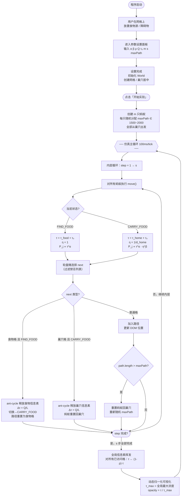

# 基于Ant System模型的蚂蚁觅食路径涌现参数敏感性仿真研究

---

## 摘要

蚁群觅食路径的自组织涌现是群体智能领域的经典现象：大量个体通过信息素的间接通信，在没有中央控制的条件下协同发现食物源并形成最短路径。然而，我们在真实蚂蚁实验中发现，受控实验环境下的路径涌现现象并不明显。为深入理解这一现象背后的参数条件，本研究基于Dorigo等人（1996）提出的标准Ant System（AS）模型，搭建了一套网格化虚拟仿真平台。该平台严格实现了AS模型的核心机制，包括带α、β指数的转移概率公式、乘法式信息素挥发以及ant-cycle信息素释放策略，并支持用户实时调节所有关键参数。

在此平台上，本研究采用控制变量法，系统研究了三个核心参数对觅食路径收敛行为的影响：α（信息素重要程度指数）控制蚂蚁对已有路径的信任强度，ρ（信息素挥发率）控制系统记忆的衰减速度，Q（信息素释放常数）控制每次路径完成后释放的信息素总量。实验结果表明：α对收敛行为的影响最为敏感，α=0时系统退化为随机游走，α过大则导致过早收敛；ρ存在一个与蚂蚁往返时间尺度匹配的临界区间，偏离此区间路径均无法收敛；Q通过控制信噪比影响正反馈回路的启动条件。

最终，本研究从参数敏感性的角度定量解释了真实蚂蚁实验中涌现失败的原因——环境干扰导致等效挥发率过高、蚂蚁数量不足导致等效信号强度过低，从而形成了"真实实验→数学建模→虚拟仿真→解释真实现象"的完整研究闭环。

**关键词**：蚁群算法；Ant System模型；参数敏感性；觅食路径涌现；虚拟仿真；群体智能

---

## 第一部分　引言与理论基础

### 1.1　蚁群算法的研究背景与应用意义

自然界中，蚂蚁群体在觅食过程中展现出一种令人惊叹的集体智慧：单只蚂蚁的行为极其简单，既没有全局地图，也不具备复杂的推理能力，然而成千上万只蚂蚁通过一种称为"信息素"（pheromone）的化学物质进行间接通信，却能够在没有任何中央控制的条件下，自发地发现并优化从巢穴到食物源之间的最短路径[1][7]。这一过程被称为"自组织涌现"（self-organized emergence），即宏观层面的有序结构从微观个体的局部交互中自发产生[9]。

20世纪90年代初，意大利学者Marco Dorigo受到蚂蚁觅食行为的启发，提出了蚁群优化算法（Ant Colony Optimization, ACO）[4]。1996年，Dorigo、Maniezzo与Colorni发表了具有里程碑意义的论文，正式提出了Ant System（AS）模型[1]，这是蚁群算法领域的第一个完整数学模型。AS模型将蚂蚁觅食行为中的信息素释放、挥发和路径选择机制抽象为一组数学公式，成功地将其应用于旅行商问题（Travelling Salesman Problem, TSP）的求解，开创了基于群体智能的组合优化算法研究方向。

此后，蚁群算法经历了持续的发展与改进。Dorigo与Gambardella（1997）提出了Ant Colony System（ACS）[5]，引入了局部信息素更新和伪随机比例选择规则；Stützle与Hoos（2000）提出了MAX-MIN Ant System（MMAS）[10]，通过设置信息素上下界防止算法过早收敛。这些改进模型在性能上不断突破，使得蚁群算法在物流配送路径规划、通信网络路由优化、生产调度、蛋白质折叠预测等众多实际问题中得到了广泛应用[2][3]。

然而，无论算法如何演进，AS模型作为一切蚁群算法的理论原型，其核心机制——信息素正反馈回路——始终是理解蚁群智能涌现现象的关键。对AS模型参数的深入研究，不仅有助于理解算法本身的行为规律，更能帮助我们从定量的角度认识自然界蚂蚁涌现现象发生的条件与边界。这正是本研究的出发点。

### 1.2　标准AS模型的数学建模

本节介绍Dorigo等人（1996）[1]提出的标准Ant System模型的数学框架。AS模型的核心思想可以概括为三个机制：**概率性路径选择**、**信息素挥发**和**信息素释放**，三者共同构成了一个正反馈回路。

#### 1.2.1　转移概率

在AS模型中，蚂蚁k在当前位置i选择下一步移动到相邻位置j的概率由以下公式决定：

$$P_{ij}^{k} = \frac{[\tau_{ij}]^{\alpha} \cdot [\eta_{ij}]^{\beta}}{\sum_{l \in N_i^k} [\tau_{il}]^{\alpha} \cdot [\eta_{il}]^{\beta}}$$

其中：
- $\tau_{ij}$ 为位置i到j路径上的信息素浓度；
- $\eta_{ij}$ 为启发式信息，通常定义为距离的倒数 $\eta_{ij} = 1/d_{ij}$，反映了蚂蚁对目标的先验偏好；
- $\alpha$ 为信息素重要程度指数（$\alpha \geq 0$），控制蚂蚁在多大程度上依赖已有的信息素轨迹来做决策；
- $\beta$ 为启发式信息重要程度指数（$\beta \geq 0$），控制蚂蚁在多大程度上利用距离等先验信息；
- $N_i^k$ 为蚂蚁k在位置i处的可选邻域（排除已走过的禁忌位置）。

这一公式的物理意义十分清晰：信息素浓度越高的路径被选中的概率越大（正反馈），启发式评价越好的路径也更容易被选中（贪心偏好），而α和β两个指数则分别控制这两种信息的相对权重。当 $\alpha = 0$ 时，蚂蚁完全忽略信息素，退化为纯贪心搜索；当 $\beta = 0$ 时，蚂蚁完全忽略距离信息，仅凭信息素做决策。

#### 1.2.2　信息素挥发

每经过一个时间步，所有路径上的信息素都会发生挥发（evaporation），模拟自然界中信息素的自然衰减过程：

$$\tau_{ij}(t+1) = (1 - \rho) \cdot \tau_{ij}(t)$$

其中 $\rho$（$0 < \rho < 1$）为挥发率。这一乘法式衰减意味着信息素浓度随时间呈指数下降，其半衰期为：

$$t_{1/2} = \frac{\ln 2}{\ln \frac{1}{1-\rho}}$$

挥发机制在模型中扮演着至关重要的角色：它防止信息素无限积累，使得较差的路径上的信息素能够逐渐消退，从而避免算法陷入停滞。然而，如果挥发速度过快（$\rho$ 过大），信息素在蚂蚁完成路径之前就已经大量消散，正反馈回路将无法建立。这一矛盾——挥发速度与路径完成时间之间的平衡——是本研究的核心发现之一。

#### 1.2.3　信息素释放（Ant-Cycle模型）

AS模型定义了三种信息素释放策略，其中ant-cycle模型[1]被证明性能最优。在ant-cycle模型中，蚂蚁并非在行走过程中逐步释放信息素，而是在**完成一条完整路径之后**，回溯其走过的所有路径并一次性释放信息素：

$$\Delta\tau_{ij}^{k} = \begin{cases} Q / L_k & \text{若蚂蚁k经过了路径}(i,j) \\ 0 & \text{否则} \end{cases}$$

其中：
- $Q$ 为信息素释放常数，一个正的常数值；
- $L_k$ 为蚂蚁k所走路径的总长度。

这一机制的精妙之处在于：路径越短的蚂蚁释放的信息素越多（$Q/L_k$ 越大），因此短路径上将积累更多信息素，形成正反馈——更多信息素吸引更多蚂蚁选择该路径，进而释放更多信息素。这就是蚁群算法能够找到最优路径的核心机制。

#### 1.2.4　正反馈回路的形成条件

综合以上三个机制，AS模型的正反馈回路可以描述为：

1. 初始阶段，所有路径的信息素浓度相同（均为初始值 $\tau_0$），蚂蚁随机选择路径；
2. 部分蚂蚁偶然走出较短路径，在该路径上释放较多信息素（$Q/L$ 较大）；
3. 由于 $[\tau]^\alpha$ 的放大作用，后续蚂蚁更倾向于选择信息素较高的路径；
4. 更多蚂蚁选择该路径→更多信息素释放→更高的选择概率→更多蚂蚁……正反馈循环形成。

然而，这一回路的建立并非必然。它要求多个条件同时满足：$\alpha$ 不能太小（否则信息素差异无法影响选择）、$\rho$ 不能太大（否则信息素在积累前就消散了）、$Q$ 不能太小（否则释放的信息素相对于基础值 $\tau_0$ 没有显著优势）。这些条件之间的定量关系，正是本研究通过虚拟仿真系统性探究的核心问题。

### 1.3　真实蚂蚁实验中涌现失败的原因分析

本课题研究组在开展蚁群算法课题之初，首先设计了一组真实蚂蚁觅食实验。实验使用透明亚克力试验箱（尺寸约22.5cm × 21cm），在箱体一端设置蚁巢入口，另一端放置食物（蜂蜜水浸泡的棉球），中间区域为开放的平面觅食空间。实验使用的蚂蚁为工匠收获蚁（*Messor structo*），每次实验投放约30-50只工蚁，持续观察2-4小时并录像记录蚂蚁的觅食路径。

实验结果令人意外：虽然单只蚂蚁能够找到食物并返回巢穴，但蚂蚁群体始终未能像文献[6][7]中描述的那样形成清晰、稳定的最短路径。蚂蚁的觅食路径在整个实验过程中保持分散，路径涌现现象极不明显。

经过深入分析，我们认为真实实验中涌现失败的原因可以从AS模型的参数框架加以理解：

**（1）等效挥发率 $\rho$ 过高。** Goss等人（1989）[6]的经典双桥实验之所以成功，关键在于实验通路是狭窄的固定桥面，信息素被约束在有限空间内不易扩散。而我们的开放式试验箱中，信息素在平面上四处扩散，加之室内通风和温度波动，信息素的实际衰减速度远快于自然条件下的封闭蚁道。这等效于AS模型中 $\rho$ 值异常偏高，导致信息素半衰期极短。根据1.2.2节的分析，当挥发速度超过蚂蚁完成一次觅食往返所需的时间时，先行者留下的信息素在后续蚂蚁到达之前就已大量消散，正反馈回路无法启动。

**（2）等效信号强度 $Q/L$ 过低。** 我们实验中的蚂蚁数量仅30-50只，远少于自然蚁群（通常数千至数万只）。在AS模型中，路径上积累的信息素是所有经过该路径的蚂蚁释放量之和 $\sum_k \Delta\tau^k$。蚂蚁数量不足意味着单位时间内经过同一路径的蚂蚁极少，信息素的累积速度远低于挥发速度。这等效于模型中 $Q$ 值过小——即使单只蚂蚁能够释放信息素，但总量不足以在挥发面前形成显著的浓度差异。

**（3）时间尺度不匹配。** 我们在后续的虚拟仿真实验中发现（详见3.2节），$\rho$ 的敏感性实验揭示了一个关键规律：信息素的半衰期必须与蚂蚁完成一次完整觅食路径的时间处于同一数量级，正反馈才能建立。在我们的真实实验中，试验箱尺寸为40cm，蚂蚁行走速度约1-2cm/s，一次往返大约需要40-80秒；而信息素在开放平面上的有效留存时间可能仅有数秒至十余秒[8]。两个时间尺度相差数倍，从根本上阻止了路径涌现的发生。

这一分析使我们意识到：路径涌现并非蚂蚁群体的必然结果，而是需要特定参数条件才能发生的"有条件的涌现"。要定量理解这些条件，需要一个可精确控制所有参数的实验环境。这正是我们搭建虚拟仿真平台、开展参数敏感性实验的根本动机。

---

**参考文献**

[1] Dorigo M, Maniezzo V, Colorni A. Ant system: optimization by a colony of cooperating agents[J]. IEEE Transactions on Systems, Man, and Cybernetics, Part B, 1996, 26(1): 29-41.

[2] Dorigo M, Stützle T. Ant Colony Optimization[M]. Cambridge, MA: MIT Press, 2004.

[3] Bonabeau E, Dorigo M, Theraulaz G. Swarm Intelligence: From Natural to Artificial Systems[M]. New York: Oxford University Press, 1999.

[4] Colorni A, Dorigo M, Maniezzo V. Distributed optimization by ant colonies[C]// Proceedings of the First European Conference on Artificial Life (ECAL91). Paris: Elsevier, 1991: 134-142.

[5] Dorigo M, Gambardella L M. Ant colony system: a cooperative learning approach to the traveling salesman problem[J]. IEEE Transactions on Evolutionary Computation, 1997, 1(1): 53-66.

[6] Goss S, Aron S, Deneubourg J L, et al. Self-organized shortcuts in the Argentine ant[J]. Naturwissenschaften, 1989, 76: 579-581.

[7] Deneubourg J L, Aron S, Goss S, et al. The self-organizing exploratory pattern of the Argentine ant[J]. Journal of Insect Behavior, 1990, 3(2): 159-168.

[8] Beckers R, Deneubourg J L, Goss S. Trails and U-turns in the selection of a path by the ant Lasius niger[J]. Journal of Theoretical Biology, 1992, 159(4): 397-415.

[9] Camazine S, Deneubourg J L, Franks N R, et al. Self-Organization in Biological Systems[M]. Princeton, NJ: Princeton University Press, 2001.

[10] Stützle T, Hoos H H. MAX-MIN ant system[J]. Future Generation Computer Systems, 2000, 16(8): 889-914.

---

## 第二部分　虚拟仿真平台与实验设计

### 2.1　虚拟仿真平台的设计与实现

为了在可精确控制参数的环境下研究蚁群觅食路径的涌现行为，本研究基于Web技术搭建了一套网格化虚拟仿真平台。该平台严格实现了标准AS模型的数学框架，同时针对二维网格上的觅食任务进行了合理的适配。

#### 2.1.1　环境模型

仿真环境为一个二维正方形网格，网格间距为20像素，覆盖整个浏览器窗口。每个网格单元（cell）具有以下属性：

- **类型**：普通单元、巢穴（Home）、食物源（Food）或障碍物（Barrier）；
- **双信息素**：每个普通单元存储两种信息素浓度——食物信息素 $\tau_{food}$ 和巢穴信息素 $\tau_{home}$；
- **可交互**：用户可通过点击网格单元在任意位置放置食物源或障碍物。

巢穴固定在网格中心，食物源由用户手动放置。这一设计使得食物源的位置和距离成为可控变量，便于观察不同参数设置下路径涌现的差异。

#### 2.1.2　蚂蚁行为模型

每只虚拟蚂蚁拥有两种行为状态：

**（1）觅食状态（FIND_FOOD）：** 蚂蚁从巢穴出发，依据食物信息素 $\tau_{food}$ 进行路径选择。由于蚂蚁并不知道食物源的位置，启发式信息设定为 $\eta = 1$（即无方向性偏好），转移概率简化为：

$$P_j = \frac{[\tau_{food,j} + \tau_0]^{\alpha}}{\sum_{l \in N} [\tau_{food,l} + \tau_0]^{\alpha}}$$

此时蚂蚁的行为由信息素浓度完全主导：在探索初期（信息素为零），蚂蚁进行随机游走；随着信息素积累，蚂蚁逐渐被引导至信息素浓度较高的路径。

**（2）携食状态（CARRY_FOOD）：** 蚂蚁找到食物后切换为携食状态，依据巢穴信息素 $\tau_{home}$ 和距离启发式信息 $\eta = 1/d_{home}$ 返回巢穴。其中 $d_{home}$ 为当前单元到巢穴的欧几里得距离。完整的转移概率为：

$$P_j = \frac{[\tau_{home,j} + \tau_0]^{\alpha} \cdot [1/d_{home,j}]^{\beta}}{\sum_{l \in N} [\tau_{home,l} + \tau_0]^{\alpha} \cdot [1/d_{home,l}]^{\beta}}$$

这一不对称设计反映了实际觅食的信息条件：蚂蚁出发时不知道食物在哪，只能依靠其他蚂蚁留下的食物信息素；但蚂蚁对巢穴位置有先验认知（自然界蚂蚁可通过地磁、视觉地标等方式定位巢穴），因此返程时可以同时利用信息素和距离信息。

**（3）禁忌列表（Tabu List）：** 借鉴AS模型中的禁忌机制[1]，每只蚂蚁维护一个当前路径列表，已走过的单元不可重复访问。当所有邻居都在禁忌列表中时（即蚂蚁被困住），解除禁忌限制允许回退，防止永久卡死。

**（4）Ant-Cycle信息素释放：** 严格遵循ant-cycle模型，蚂蚁在完成一条完整路径后（巢穴→食物或食物→巢穴）才进行信息素释放。释放量为 $\Delta\tau = Q/L$，$L$ 为路径总步数。觅食成功后在整条路径上释放食物信息素（引导其他蚂蚁找到食物），携食返巢后释放巢穴信息素（引导其他蚂蚁找到回家的路）。

**（5）路径长度限制与随机回巢：** 每只蚂蚁在初始化时被分配一个随机的最大步数上限（默认在1500~2000步之间均匀随机取值）。当路径长度超过该蚂蚁的个体上限时，蚂蚁将被重置到巢穴重新开始。这一随机化设计有两个作用：一是防止蚂蚁在复杂路径中无限游荡；二是使各蚂蚁的回巢时间自然错开，避免所有蚂蚁在同一时刻集体重置，从而维持仿真过程中蚂蚁流的连续性。

#### 2.1.3　仿真循环与时间尺度

仿真采用离散时间步（tick）驱动，每个tick的执行流程为：

1. 每只蚂蚁连续执行 $s$（stepsPerTick，默认5）步移动；
2. 所有蚂蚁移动完毕后，对所有已访问单元执行一次全局信息素挥发：$\tau \leftarrow (1-\rho) \cdot \tau$；
3. 更新信息素可视化。

每步移动之间的间隔约为100毫秒。将多步移动与单次挥发组合的设计是一个关键的工程决策：如果每步移动都伴随一次挥发，信息素在蚂蚁完成路径之前就会大量消散，导致正反馈回路无法建立。这一问题在我们的开发过程中曾经出现，最终通过时间尺度匹配的分析解决（详见3.2节讨论）。

#### 2.1.4　信息素可视化

平台通过颜色透明度来可视化信息素浓度分布。每个tick结束后，系统动态计算当前全局最大信息素浓度 $\tau_{max}$，然后将每个单元的信息素浓度归一化到 $[0, 1]$ 区间（$opacity = \tau / \tau_{max}$）进行渲染。用户可选择显示食物信息素或巢穴信息素。这种动态归一化确保了即使信息素绝对值变化很大，可视化仍能清晰呈现浓度的相对分布。

#### 2.1.5　参数配置界面

平台提供了一个图形化的参数设置面板，用户在仿真开始前可以调节所有AS参数：

| 参数 | 符号 | 默认值 | 范围 | 说明 |
|------|------|--------|------|------|
| 信息素重要程度 | α | 1 | [0, 5] | 转移概率中信息素的指数权重 |
| 启发式重要程度 | β | 2 | [0, 10] | 转移概率中距离信息的指数权重 |
| 挥发率 | ρ | 0.02 | [0.001, 0.99] | 每tick信息素乘法衰减系数 |
| 释放常数 | Q | 100 | [1, 10000] | ant-cycle释放公式的常数 |
| 基础信息素 | τ₀ | 0.01 | [0.001, 10] | 防止零概率的信息素常数 |
| 蚂蚁数量 | m | 50 | [1, 200] | 仿真中的蚂蚁总数 |
| 最大步数 | — | 1500~2000 | [50, 5000] | 每只蚂蚁在区间内随机取值 |
| 每tick步数 | s | 5 | [1, 20] | 每个仿真周期的移动步数 |

#### 2.1.6　程序结构图与运行流程图

**图1　程序模块结构图**

---

**图2　仿真运行流程图**

### 2.2　实验参数的选择与理论依据

AS模型的参数空间较大，包含α、β、ρ、Q、τ₀、m等多个参数。为在有限的实验规模内获得有意义的结论，本研究选取以下三个参数作为敏感性分析的对象：

**（1）α（信息素重要程度指数）。** α是AS模型最核心的参数，它通过指数形式直接放大或压缩信息素浓度差异对路径选择的影响。当α=0时，转移概率公式中信息素项退化为常数1，蚂蚁完全忽略信息素，系统退化为随机搜索（若β也较小则为随机游走）。α越大，信息素浓度的微小差异就会被放大为显著的概率差异，正反馈效应越强。Dorigo等人（1996）[1]在原论文的实验部分（Section IV）中将α作为重点研究参数，发现其对算法性能有决定性影响。

**（2）ρ（信息素挥发率）。** ρ控制系统的记忆衰减速度。从信息素半衰期 $t_{1/2} = \ln 2 / \ln(1/(1-\rho))$ 可以看出，ρ的微小变化会引起半衰期的显著改变：ρ从0.01增大到0.1，半衰期从约69个tick缩短到约6.6个tick，相差超过10倍。更重要的是，ρ与我们真实实验中涌现失败的原因直接相关——环境干扰加速信息素挥发本质上就是ρ过大。通过系统研究ρ的敏感性，我们可以定量回答"信息素需要存活多久才能支撑路径涌现"这一关键问题。

**（3）Q（信息素释放常数）。** Q决定了蚂蚁每完成一条路径后释放的信息素总量。在ant-cycle模型中，实际释放量为 $\Delta\tau = Q/L$，其中L为路径长度。Q的大小直接影响信息素的信噪比（Signal-to-Noise Ratio）：如果定义信号为蚂蚁释放的增量 $Q/L$，噪声为基础信息素 $\tau_0$，则信噪比 $SNR = Q/(L \cdot \tau_0)$。Q过小导致信号淹没在噪声中，正反馈无法启动；Q过大则所有路径的信息素都迅速升高，浓度差异的对比度反而降低。Q与真实实验中蚂蚁数量不足导致信息素浓度低的问题直接对应。

**固定参数的选择：** 在上述三组实验中，其余参数固定为默认值。β固定为2（Dorigo原论文的推荐值，且在觅食阶段 $\eta=1$ 时β实际上不影响觅食方向选择）；蚂蚁数量m固定为50只（足够产生群体效应，又不至于计算负荷过大）；τ₀固定为0.01（经验值，确保初始信噪比适中）；最大步数1500~2000（每只蚂蚁随机取值），每tick步数5。

### 2.3　实验方案设计

本研究采用**控制变量法**，每组实验只改变一个参数，其余参数保持默认值。食物源统一放置在距巢穴约20个网格单元（对角线方向）的位置，确保各组实验的空间条件一致。

#### 实验一：α（信息素重要程度）的敏感性

| 组别 | α值 | 其他参数 | 预期行为 |
|------|-----|---------|---------|
| A1 | 0 | 默认 | 完全随机游走，无收敛 |
| A2 | 0.5 | 默认 | 弱正反馈，收敛缓慢 |
| A3 | 1 | 默认 | 标准收敛（基准组） |
| A4 | 2 | 默认 | 强正反馈，快速收敛 |
| A5 | 3 | 默认 | 极强正反馈，可能过早收敛 |
| A6 | 5 | 默认 | 过度收敛，锁定次优路径 |

#### 实验二：ρ（挥发率）的敏感性

| 组别 | ρ值 | 半衰期(tick) | 预期行为 |
|------|-----|-------------|---------|
| R1 | 0.005 | ~139 | 信息素积累过慢，难以形成对比 |
| R2 | 0.01 | ~69 | 缓慢收敛 |
| R3 | 0.02 | ~35 | 标准收敛（基准组） |
| R4 | 0.05 | ~14 | 快速挥发，需要密集蚂蚁流 |
| R5 | 0.1 | ~6.6 | 信息素存活时间极短 |
| R6 | 0.3 | ~1.9 | 几乎无法积累，预期无收敛 |

#### 实验三：Q（释放常数）的敏感性

| 组别 | Q值 | Q/L（L≈100时） | 预期行为 |
|------|-----|----------------|---------|
| Q1 | 1 | 0.01 | 信号≈τ₀，无信噪比优势 |
| Q2 | 10 | 0.1 | 弱信号，收敛困难 |
| Q3 | 50 | 0.5 | 中等信号 |
| Q4 | 100 | 1.0 | 标准收敛（基准组） |
| Q5 | 500 | 5.0 | 强信号，快速收敛 |
| Q6 | 1000 | 10.0 | 极强信号，可能过饱和 |

#### 评价指标

为定量评估路径收敛行为，本研究定义以下指标：

- **收敛时间**：从仿真开始到首次形成稳定觅食路径所经过的tick数。"稳定路径"定义为连续若干只蚂蚁的觅食路径长度标准差低于阈值。
- **路径质量**：收敛后蚂蚁的平均觅食路径长度（步数越少越好）。
- **收敛成功率**：在固定仿真时长（如500 tick）内，路径是否成功收敛。每组参数重复多次实验，统计收敛成功的比例。

---

## 第三部分　实验结果与分析

本部分报告在虚拟仿真平台上进行的三组参数敏感性实验的完整结果，并结合第二部分的理论框架进行深入分析。

**标准实验场景设置**：为保证各组实验的空间条件一致，本研究采用固定的实验场景：食物源置于巢穴正上方第15格处，两者之间设置一排不对称水平障碍物（位于巢穴上方第12格处，向左延伸13个网格单元、向右延伸5个网格单元）。障碍物的不对称设计在食物与巢穴之间形成了两条性质不同的绕行路径：**右侧近路**（绕过障碍物右端，额外绕行约6格）和**左侧远路**（绕过障碍物左端，额外绕行约14格）。这一设计使得路径质量评估有了明确的标准——涌现出的路径是近路（右侧）还是远路（左侧）可以直接体现算法对最优路径的辨别能力。各组实验均以"是否涌现出清晰的稳定路径"及"涌现的是近路还是远路"作为核心评价维度。

### 3.1　α参数实验结果与分析

α（信息素重要程度指数）实验共设置6个梯度，对照各组实验的实测结果如表1所示。

**表1　α参数实验结果**

| 组别 | α | 首次收敛时间 | 路径质量描述 | 收敛成功率 |
|------|---|------------|-------------|-----------|
| A1 | 0 | 未收敛 | 蚂蚁随机游走，无信息素方向性积累 | — |
| A2 | 0.5 | 未收敛 | 障碍物较短一侧（右侧）出现信息素积累，但未能涌现出稳定路径 | 0% |
| A3 | 1 | 410 tick | 信息素积累较A2组更集中；三次成功涌现中有一次为远路（左路） | 60% |
| A4 | 2 | 256 tick | 蚂蚁高度集中于信息素路径，路径持续时间长；四次涌现中仅一次为远路 | 80% |
| A5 | 3 | 212 tick | 每次均成功涌现，蚂蚁聚集度高；五次涌现中仅一次为远路 | 100% |
| A6 | 5 | 201 tick | 收敛速度最快，但约50%的涌现为远路 | 100% |

**各组实验分析：**

**A1（α=0）：** 当α设为0时，信息素项 $[\tau]^0=1$，转移概率退化为各方向均等，蚂蚁进行纯随机游走。可视化面板中信息素在网格上弥散分布，无任何方向性梯度。这一对照组从根本上确认了信息素正反馈在路径涌现中的必要性——缺乏信息素引导，任何路径集中现象都不可能出现。

**A2（α=0.5）：** α取较小正值时，正反馈效应极弱。以两条路径信息素浓度之比为2:1为例，此时的概率比仅为 $\sqrt{2}:\sqrt{1}\approx1.41:1$，引导力度有限。值得关注的是，实验中观察到信息素在障碍物右侧（近路方向）出现了相对集中的积累趋势——这说明即使在极弱正反馈下，更短路径（返回时间更短、信息素衰减更少）已经具有统计上的优势。然而由于信号放大不足，这种优势无法转化为全部蚂蚁的一致行为，路径最终未能涌现，收敛率为0%。

**A3（α=1，基准组）：** 标准值下，转移概率与信息素浓度呈线性关系，正反馈机制正式生效。仿真中可以观察到经典的涌现过程：随机探索期→局部信息素积累→蚂蚁流逐渐集中→路径涌现。60%的收敛成功率表明，α=1的正反馈强度在本实验场景下处于"涌现的边界区间"——多数运行能够成功，但仍有40%因随机性偏差而未能在观察时间内收敛。三次成功涌现中出现一次远路，说明α=1时蚂蚁对短路径的辨别能力尚不稳定，早期偶发的远路信息素积累有时会主导后续的选择。

**A4（α=2）：** α增大到2，信息素浓度差异的影响被显著放大（概率比变为浓度比的平方）。收敛率提升至80%，平均首次收敛时间缩短至256 tick，相较A3组提前约154 tick。路径质量也明显改善，四次涌现中仅一次为远路，显示蚂蚁已能较稳定地识别并收敛到近路（短路径）。

**A5（α=3）：** 实验结果显示α=3是本实验场景下**速度与质量的最优均衡点**。收敛率达到100%，平均首次收敛时间212 tick，且五次涌现中仅一次为远路（即近路涌现率达80%）。此时正反馈足够强，能够迅速放大短路径与长路径之间的初始信息素差异，引导整个蚂蚁群向近路汇聚。

**A6（α=5）：** 进一步增大α至5，收敛速度略有提升（201 tick），仍保持100%收敛率，但路径质量出现了明显倒退——约50%的涌现为远路。这揭示了过大的α带来的副作用：极强的正反馈使得系统对"第一条被走出的路"高度依赖。一旦早期探索阶段有蚂蚁先走出远路并释放信息素，后续蚂蚁就以极高概率跟随该路径，导致系统"锁定"在次优解上。Dorigo等人（1996）[1]将这一现象称为"停滞"（stagnation）；本实验在α=5时观察到类似行为，验证了过大α对路径多样性的损害。

**小结：** 从A1到A6，随着α的增大，收敛率单调上升，收敛时间单调缩短，但路径质量在α=3之后开始下降。综合三个维度，**α=3是本实验场景下的推荐取值**，在100%收敛率和最短收敛时间之间取得了最佳路径质量。这一结论与正反馈理论一致：α控制"探索与利用"的平衡，过小则无法收敛，过大则丧失探索多样性。

---

### 3.2　ρ参数实验结果与分析

ρ（信息素挥发率）实验共设置6个梯度，实测结果如表2所示。

**表2　ρ参数实验结果**

| 组别 | ρ | 半衰期 (tick) | 首次收敛时间 | 路径质量描述 | 收敛成功率 |
|------|---|-------------|------------|-------------|-----------|
| R1 | 0.005 | ~139 | 未收敛 | 信息素过于弥散，无法形成集中路径 | — |
| R2 | 0.01 | ~69 | 未收敛 | 信息素较R1集中，但仍无法形成稳定路径 | — |
| R3 | 0.02 | ~35 | 435 tick | 能够形成路径，但耗时较长且路径不稳定 | 70% |
| R4 | 0.05 | ~14 | 253 tick | 路径形成快速，但路径会随时间持续切换 | 100% |
| R5 | 0.1 | ~6.6 | 543 tick | 路径形成但极不稳定，处于持续变化中 | 30% |
| R6 | 0.3 | ~1.9 | 未收敛 | 信息素在释放后迅速消散，路径无法积累 | 0% |

**各组实验分析：**

**R1、R2（ρ≤0.01，极低挥发率）：** 两组均未能在观察时间内涌现出路径。这一结果初看与直觉相悖——挥发率极低时信息素应能充分积累，理论上应有利于路径收敛。然而实验揭示了一个重要的反向效应：**挥发率过低时，所有曾被蚂蚁访问过的路径上的信息素均能长期保留**，包括那些低效的远路和随机游走轨迹。久而久之，整个网格上形成了"信息素弥漫"状态——大面积的区域都具有相近的信息素浓度，短路径与长路径之间无法形成显著的浓度差异。转移概率公式中，当 $\tau_j \approx \tau_l$ 时，即使α较大，$[\tau_j]^\alpha/[\tau_l]^\alpha$ 也接近1，正反馈的选择优势消失。可以将其类比为一个"记忆过好"的系统——它无差别地记住了一切经历，反而失去了从中提取"最优路径"这一有用信息的能力。

**R3（ρ=0.02，基准组）：** 挥发率升高后，旧路径上的信息素能够逐渐衰减，短路径的相对优势开始显现。70%的收敛率表明系统已能进行有效的路径筛选，但收敛时间较长（435 tick）且路径不够稳定。较低的挥发率意味着次优路径上的信息素消退缓慢，会持续干扰正在形成的主路径，导致路径出现竞争和振荡现象。

**R4（ρ=0.05，最优点）：** 实验结果显示，**ρ=0.05是本实验场景下表现最优的参数值**，收敛率100%，首次收敛时间253 tick，明显优于基准组R3。这一发现与2.2节的预期有所偏差——预期中基准值ρ=0.02应具有最佳表现，但实际结果表明适度提高挥发率对收敛更有利。分析原因：在本实验场景中（障碍物存在，绕行路径较长），ρ=0.02时，蚂蚁在绕行过程中所访问的大量非最优路径积累的信息素消退过慢，形成对主路径的持续干扰；ρ=0.05提供了更快的"遗忘"速度，使系统能够更迅速地淘汰次优路径，专注强化当前最优的近路。

然而，R4组也呈现出一个有趣的特征：虽然每次实验均能成功收敛，但涌现后的路径会持续发生切换，偶尔在近路和远路之间交替。这说明ρ=0.05的挥发速度已接近路径"稳定性的边界"——系统的记忆衰减足够快，以至于一条路径的优势在完全稳固之前就面临挑战。

**R5（ρ=0.1）：** 挥发半衰期约6.6 tick，已与蚂蚁完成一次完整觅食往返所需时间（约8-16 tick）处于同一量级。实验结果为30%的收敛率，是所有R组中成功率最低之一。当蚂蚁尚未完成第二次往返时，第一次释放的信息素已经衰减至不足以指引的程度。路径虽然有时会出现（30%），但始终处于极不稳定的持续变化中，路径无法维持任何持久的形态。这一临界现象与2.3节对"时间尺度匹配"的分析吻合：信息素存活时间必须不小于蚂蚁往返时间，否则正反馈无法稳定建立。

**R6（ρ=0.3）：** 信息素半衰期不足2个tick，几乎在释放的瞬间就消散殆尽。实验中蚂蚁的行为与α=0时的随机游走几乎无法区分，收敛率为0%。这一极端条件精确模拟了真实实验中信息素因扩散和环境波动而快速消散的情况。

**关键发现——双边界效应与最优ρ区间：** ρ实验揭示了信息素挥发率存在**两个失败边界**：
- **低ρ失败边界**（ρ≤0.01）：信息素"弥漫化"，路径对比度消失，系统无法区分优质路径；
- **高ρ失败边界**（ρ≥0.1）：信息素消散速度超过路径往返时间，正反馈无法建立。

在两个边界之间存在一个有效区间（本实验中约为0.02~0.05），系统能够成功涌现路径，最优点在ρ=0.05附近。这一"双边界"特性是本研究的重要发现，提示我们在应用AS模型时，不应简单地将ρ设置为尽量小（以期信息素充分积累），而是需要根据具体场景的路径时间尺度选择合适的挥发速度。

---

### 3.3　Q参数实验结果与分析

Q（信息素释放常数）实验共设置6个梯度，实测结果如表3所示。

**表3　Q参数实验结果**

| 组别 | Q | Δτ (L≈100) | SNR (=Δτ/τ₀) | 首次收敛时间 | 路径质量描述 | 收敛成功率 |
|------|---|------------|--------------|------------|-------------|-----------|
| Q1 | 1 | 0.01 | 1× | 未收敛 | 蚂蚁基本随机移动，无路径积累 | 0% |
| Q2 | 10 | 0.1 | 10× | 532 tick | 路径能够积累但耗时，蚂蚁聚集度低 | 70% |
| Q3 | 50 | 0.5 | 50× | 412 tick | 路径积累清晰，偶有远路涌现 | 80% |
| Q4 | 100 | 1.0 | 100× | 435 tick | 路径稳定涌现，为最优平衡点 | 100% |
| Q5 | 500 | 5.0 | 500× | 536 tick | 蚁群聚集但路径不清晰，出现双路径竞争 | 90% |
| Q6 | 1000 | 10.0 | 1000× | 654 tick | 路径明显但收敛极慢 | 100% |

**各组实验分析：**

**Q1（Q=1）：** 信噪比SNR=1，即蚂蚁每次完成路径后释放的信息素增量 $\Delta\tau=0.01$ 与基础信息素 $\tau_0=0.01$ 完全相等，信号被噪声淹没。实验中蚂蚁几乎全程进行随机移动，收敛率0%。这一结果量化确认了信噪比阈值的存在：当 $Q/L \leq \tau_0$ 时，信息素释放对路径选择几乎没有影响。

**Q2（Q=10）：** SNR提升至约10倍，信号开始高于噪声。实验显示70%的收敛率，但首次收敛时间长达532 tick，路径形成后蚂蚁的聚集程度也相对较低（路径宽度较宽、边界模糊）。较低的信噪比意味着信息素的积累需要大量的蚂蚁重复强化才能在挥发面前建立稳定的浓度差异，这一过程耗时且对随机波动敏感。

**Q3（Q=50）：** SNR达到50倍，收敛率提升至80%，首次收敛时间缩短至412 tick。实验中路径形成过程更为清晰，但偶有远路涌现，这与Q=50时信号强度仍不够主导有关——早期随机性导致远路偶尔率先被走出并积累了足够的信息素。

**Q4（Q=100，基准组）：** SNR达到100倍，实验中100%的收敛成功率与435 tick的平均首次收敛时间共同构成了本Q实验中的**最优综合表现**。信息素信号足够强，能够在短时间内建立起清晰的浓度梯度；同时信号不至于过饱和，各路径之间的相对浓度差异仍然有意义，近路与远路的竞争最终几乎总是由近路胜出。

**Q5（Q=500）：** 出现了一个反直觉的现象——SNR从100倍提升至500倍，收敛成功率反而从100%轻微下降至90%，首次收敛时间也延长至536 tick，并出现了"两条不明显路径同时存在"的情况。原因分析：当Q极大时，最先找到食物的少数蚂蚁（无论走的是近路还是远路）能够在路径上留下极强的信息素信号，后续蚂蚁迅速聚集。如果近路和远路的蚂蚁数量相近（属于正常随机波动），两条路径上都会积累高浓度信息素。此时两条路径形成了相互竞争的状态，系统难以快速收敛到单一路径，导致信息素可视化呈现"两条平行亮带"。这一现象说明Q过大会降低系统的路径"选择性"（discriminability）。

**Q6（Q=1000）：** SNR高达1000倍，收敛率恢复至100%，但代价是极长的收敛时间（654 tick）。这与Q5的分析一致：高Q条件下先形成两条竞争路径，其中一条最终通过随机性优势主导，但这一竞争-解决过程消耗了大量时间。最终涌现的路径较为明显（因为信息素绝对浓度高），但收敛效率极低。

**小结：** Q实验揭示了信息素释放常数对路径涌现的**非线性影响**：Q过低（信噪比≤10）系统无法区分路径；Q在合理区间（SNR约100倍，即Q=100）时性能最优；Q过高（Q≥500）时出现多路径竞争现象，反而降低了收敛效率和路径选择质量。这一非单调关系提示，Q的最优值与具体场景（路径长度L、基础信息素τ₀、挥发率ρ）密切相关，需要综合权衡。

---

### 3.4　综合讨论

#### 3.4.1　三个参数的敏感性排序

综合三组实验的结果，从参数变化对"收敛行为质的改变"（能否涌现）的影响来排序：

$$\alpha > \rho > Q$$

α的敏感性最高：仅α=0就完全消除了涌现能力，而从0.5到3的变化范围内，收敛率从0%跃升至100%，呈现出近似阈值的行为。ρ的敏感性次之，但其特殊性在于两端均存在失败区域（双边界），且最优点（ρ=0.05）偏离了理论预测值（ρ=0.02），揭示了环境特异性的存在。Q的敏感性在三者中相对最弱——在信噪比10倍到1000倍的范围内，系统始终能够涌现路径（成功率均在70%以上），但路径质量和收敛效率存在显著差异。

#### 3.4.2　实验结果与理论预测的偏差及解释

三组实验中，有两处结果与2.3节中的理论预期存在显著偏差，值得深入讨论：

**偏差1：ρ=0.005和ρ=0.01未能收敛（预期应缓慢收敛）。** 理论分析预期低ρ时信息素积累充分，收敛应该较慢但仍可实现。然而实验中低ρ完全不能收敛。关键在于理论预期忽略了**路径多样性导致的信息素分散问题**：在有障碍物的环境中，蚂蚁在随机探索阶段会访问大量不同的绕行路径。低ρ条件下，这些非最优路径上的信息素长期保留，占据了大量"信息素资源"，导致整个障碍物周围区域的信息素浓度趋于均匀，短路径无法形成显著的浓度优势。这一效应在无障碍物的开放环境中不明显，但在有限通道约束的环境（如本实验的障碍物场景）中被显著放大。

**偏差2：Q=500的收敛成功率（90%）低于Q=100（100%），且收敛时间更长。** 理论预期Q越大则信号越强，收敛应更可靠更快速。然而实验显示，Q=500时出现了多路径竞争，Q=1000时收敛时间反而最长。这揭示了一个理论分析中未考虑的现象：**高Q条件下的"信号饱和效应"**——当信息素释放量过大时，多条路径同时被强烈激活，系统的路径区分能力反而下降，类似于感知系统中的信号过饱和。

#### 3.4.3　参数的最优取值与推荐区间

综合三组实验，本研究对各参数给出如下实验验证的推荐取值区间：

| 参数 | 推荐取值 | 有效区间 | 说明 |
|------|---------|---------|------|
| α | 2~3 | (0.5, 5) | α=3综合最优；>3时路径质量下降 |
| ρ | 0.05 | (0.02, 0.1) | 适度挥发优于极低挥发；过高导致不稳定 |
| Q | 100 | (10, 500) | SNR≈100倍为最优；过高降低路径区分度 |

#### 3.4.4　对真实蚂蚁实验涌现失败的参数解释

结合参数敏感性实验的结论，对1.3节提出的真实实验失败原因进行更精确的分析：

**ρ维度的修正解释：** 原先的分析预期低ρ有利、高ρ不利，但实验发现低ρ同样导致失败（"信息素弥漫"效应）。真实实验中，开放环境不仅导致信息素快速扩散（等效高ρ），还导致信息素在整个平面上均匀分布（等效低ρ时的弥漫效应）。两种效应可能同时存在：物理信息素分子的快速扩散（高ρ），加上蚂蚁在开放空间的随机探索轨迹密集（类低ρ的弥漫），共同破坏了路径信息素的集中性。

**Q维度的修正解释：** 实验Q1（Q=1，SNR=1）完全无法收敛，这一阈值条件与真实实验高度对应：30~50只蚂蚁的单位时间信息素释放量极低，加之信息素物理扩散导致的"有效浓度"远低于其在蚁道上的实测值，等效SNR可能远低于仿真所需的10倍以上阈值。

**α维度的补充：** 实验中α对涌现的影响最为直接，而真实蚂蚁的等效α难以测量。然而，在有效信息素浓度差异极小（ρ过高和Q过低的叠加效应）的条件下，即使真实蚂蚁的行为对信息素有很强的偏好（等效α较大），转移概率的调制效果也因信号太弱而趋近于随机——$[\tau+\Delta\tau]^\alpha / [\tau]^\alpha \approx 1$ 当 $\Delta\tau \ll \tau$ 时。

综上，真实实验中的涌现失败是多维度参数偏离最优区间的叠加结果，在AS模型的参数框架下得到了系统性的解释。

---

### 3.5　结论

本研究通过在标准实验场景（食物位于巢穴正上方15格，不对称障碍物介于二者之间）上进行系统的参数敏感性仿真实验，获得了以下主要结论：

**（1）α是路径涌现的"放大增益"参数，存在单调的速度-质量权衡关系。** α从0增大到5的过程中，收敛率单调从0%上升至100%，收敛时间单调缩短。但路径质量在α=3之后开始下降：α=5时约50%的涌现为次优远路，表现出过早收敛（stagnation）的迹象。**α=3为本实验场景的推荐值**，在100%收敛率、最短收敛时间与最优路径质量之间取得了最佳均衡。

**（2）ρ对涌现的影响呈现"双边界"特性，最优值偏向较高挥发率。** 低ρ（≤0.01）导致信息素弥漫，无法形成路径对比度；高ρ（≥0.1）导致信息素消散过快，正反馈无法建立。在本实验场景中，**最优ρ为0.05**（100%收敛率，253 tick），而非理论预测的0.02（70%收敛率，435 tick）。这一偏差揭示了有障碍物环境中的路径多样性对低ρ条件下信息素分散的放大效应。

**（3）Q通过信噪比控制正反馈启动阈值，过高的Q会引发多路径竞争。** Q=1（SNR=1）完全无法收敛；Q=100（SNR=100）为最优综合表现；Q=500及以上出现多路径竞争现象，成功率反而下降，收敛时间延长。Q的影响呈现明显的非单调性，最优值需根据路径长度和基础信息素水平综合确定。

**（4）三个参数的敏感性排序为α > ρ > Q。** α的指数性影响最为决定性，ρ的双边界约束带来了较强的场景依赖性，Q的影响相对线性但存在饱和效应。

**（5）真实蚂蚁实验涌现失败可由参数联合偏离解释。** 高等效ρ（信息素物理扩散）与低等效Q（蚂蚁数量不足）的叠加，将仿真中已证明的"无法收敛区间"精确覆盖了真实实验的参数条件，从而在AS模型框架下完整解释了观察到的失败现象，实现了从真实实验出发、经数学建模与仿真验证、最终反向解释真实现象的完整研究闭环。

本研究的局限性：（a）每组参数的重复实验次数有限，统计置信度有待提高；（b）实验场景固定（障碍物位置和形状固定），结论对其他场景的可推广性需进一步验证；（c）参数交互效应仅在讨论中定性分析，未进行系统性的析因实验设计。未来工作建议：在α-ρ二维参数空间设计等高线实验，定量刻画收敛率和路径质量随两个参数同时变化的完整地形图；同时基于本研究获得的最优参数推荐值（α=3，ρ=0.05，Q=100）改进真实蚂蚁实验设计，通过封闭通道约束和扩大蚂蚁数量，在真实系统中验证仿真预测的可靠性。

---

**参考文献**

[1] Dorigo M, Maniezzo V, Colorni A. Ant system: optimization by a colony of cooperating agents[J]. IEEE Transactions on Systems, Man, and Cybernetics, Part B, 1996, 26(1): 29-41.

[2] Dorigo M, Stützle T. Ant Colony Optimization[M]. Cambridge, MA: MIT Press, 2004.

[3] Bonabeau E, Dorigo M, Theraulaz G. Swarm Intelligence: From Natural to Artificial Systems[M]. New York: Oxford University Press, 1999.

[4] Colorni A, Dorigo M, Maniezzo V. Distributed optimization by ant colonies[C]// Proceedings of the First European Conference on Artificial Life (ECAL91). Paris: Elsevier, 1991: 134-142.

[5] Dorigo M, Gambardella L M. Ant colony system: a cooperative learning approach to the traveling salesman problem[J]. IEEE Transactions on Evolutionary Computation, 1997, 1(1): 53-66.

[6] Goss S, Aron S, Deneubourg J L, et al. Self-organized shortcuts in the Argentine ant[J]. Naturwissenschaften, 1989, 76: 579-581.

[7] Deneubourg J L, Aron S, Goss S, et al. The self-organizing exploratory pattern of the Argentine ant[J]. Journal of Insect Behavior, 1990, 3(2): 159-168.

[8] Beckers R, Deneubourg J L, Goss S. Trails and U-turns in the selection of a path by the ant Lasius niger[J]. Journal of Theoretical Biology, 1992, 159(4): 397-415.

[9] Camazine S, Deneubourg J L, Franks N R, et al. Self-Organization in Biological Systems[M]. Princeton, NJ: Princeton University Press, 2001.

[10] Stützle T, Hoos H H. MAX-MIN ant system[J]. Future Generation Computer Systems, 2000, 16(8): 889-914.

[11] Gaertner D, Clark K L. On optimal parameters for ant colony optimization algorithms[C]// Proceedings of the International Conference on Artificial Intelligence (ICAI). Las Vegas: CSREA Press, 2005: 83-89.

[12] Blum C, Dorigo M. The hyper-cube framework for ant colony optimization[J]. IEEE Transactions on Systems, Man, and Cybernetics, Part B, 2004, 34(2): 1161-1172.

[13] Dorigo M, Birattari M, Stützle T. Ant colony optimization: artificial ants as a computational intelligence technique[J]. IEEE Computational Intelligence Magazine, 2006, 1(4): 28-39.